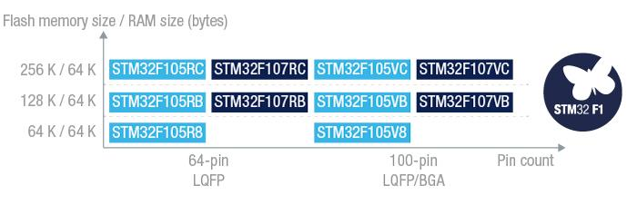

# [STM32F105](https://github.com/sochub/STM32F105)
 
####  qitas@qitas.cn
#### 父级：[STM32F1](https://github.com/sochub/STM32F1) 
#### 归属：[Cortex M3](https://github.com/sochub/CM3) 
## [简介](https://github.com/sochub/STM32F105/wiki)

STM32F105器件采用Cortex-M3内核，CPU最高速度达72 MHz。

该系列具有64~256KB片上Flash存储器、64KB SRAM和14个通信接口。

 

### [收录资源](https://github.com/sochub/STM32F105)

* [参考文档](docs/)
* [参考资源](src/)
* [模板工程](demo/)
* [编译工具](https://github.com/sochub/arm-none-eabi)

### [替换方案](https://github.com/sochub/STM32F105)

* 向下替换方案 [STM32F103](https://github.com/sochub/STM32F103) 
* 向上替换方案 [STM32F107](https://github.com/sochub/STM32F107) 

##  [SoC资源平台](http://www.qitas.cn)
