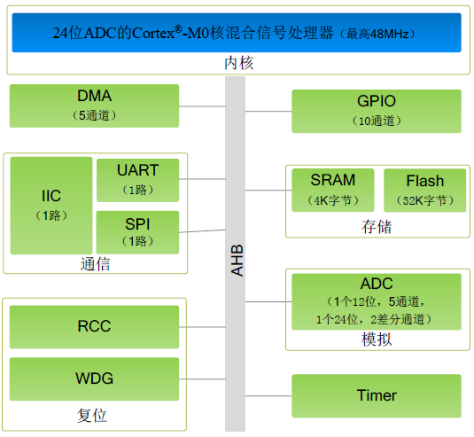

# [ZML165](https://github.com/SoCXin/ZML165)

* [ZLG](https://www.zlgmcu.com): [Cortex-M0+](https://github.com/SoCXin/Cortex)
* [L3R4](https://github.com/SoCXin/Level): 48 MHz

### [Xin简介](https://github.com/SoCXin/ZML165/wiki)

[ZML165](https://github.com/SoCXin/ZML165) 单芯片集成2通道24bit ADC,还包括4个16位的通用定时器，1个32位通用定时器，1个高级PWM定时器，1个UART接口，1个I²C接口和1个SPI接口。

#### 核心功能

* 2ch 24bit Σ-∆ ADC

### [xin资源](https://github.com/SoCXin/CS32A039)

* [参考资源](src/)
* [相关文档](docs/)
* [典型应用](project/)
* [入门教程](https://docs.soc.xin/ZML165)

### [选型建议](https://github.com/SoCXin)

[ZML165](https://github.com/SoCXin/ZML165) 和 [ZML166](https://github.com/SoCXin/ZML166) 相比更精简，同时还拥有12bit 1us高速ADC外设，可以完成更丰富的应用

### [探索芯世界 www.SoC.xin](http://www.SoC.Xin)
